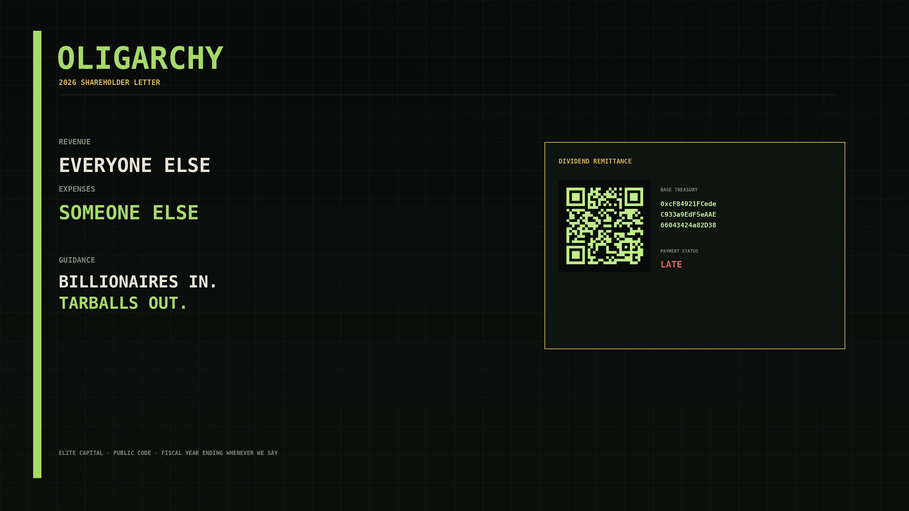
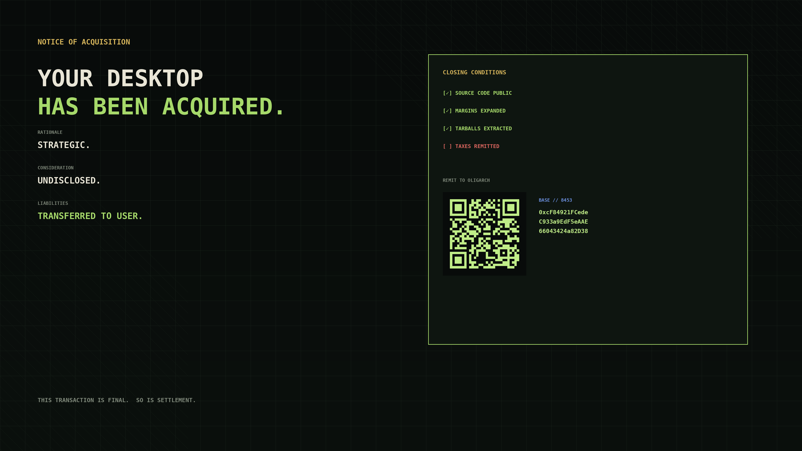

# OLIGARCHY

> **Elite capital. Public code. Pay your taxes.**


A complete Omarchy Quattro theme **and native shell experience** for the 2026 **Oligarchy** challenge.

The design language is equal parts financial terminal, government tax notice, 1980s annual report, private banking, and Unix workstation. The joke is loud enough to land and restrained enough to leave the desktop usable.

## The Department of Oligarch Revenue is the default

The active `backgrounds/` directory intentionally contains **one** wallpaper, prefixed with `+` so it sorts ahead of stale numeric backgrounds during manual upgrades:

`backgrounds/+tax-department.png`

That makes the Department of Oligarch Revenue the first-run OLIGARCHY desktop instead of relying on filename ordering among multiple wallpapers.

## This is not just a wallpaper pack

OLIGARCHY has two deliberately separate layers:

1. A safe Git-installed theme that changes the palette, bar, controls, spacing, typography, popups, tooltips, notifications, launcher, menus, Polkit, lock screen, image picker, keyboard RGB, icons, unlock art, and desktop.
2. An optional native Quickshell plugin that adds the **Department of Oligarch Revenue** to the Omarchy bar.

Click `TAX` to open a keyboard-friendly collection panel. It shows the verified treasury QR, copies the exact address, opens the public Base ledger, and issues fresh satirical assessments. Right-click copies immediately; middle-click reassesses. No wallet connection, payment request, network fetch, secret, background service, or install hook is involved.

## Pay your taxes to the oligarch

**Network:** Base  
**Chain ID:** 8453  
**Treasury:**

```text
0xcF84921FCedeC933a9EdF5eAAE66043424a82D38
```


The standalone QR encodes the exact address and is independently decoded during release validation. It uses high error correction, a six-module quiet zone, and hard pixel edges for reliable scanning.

After installation, copy the treasury address directly to the Wayland clipboard with:

```bash
wl-copy < ~/.config/omarchy/themes/oligarchy/TREASURY.txt
```

Or print it with:

```bash
cat ~/.config/omarchy/themes/oligarchy/TREASURY.txt
```

No payment is required to use the theme. Voluntary compliance remains mandatory.

## Install the visual theme

```bash
omarchy theme install https://github.com/rookepoole/omarchy-oligarchy-theme.git
```

## Add the native Tax Department

Omarchy plugins are code, so Omarchy will show its normal review warning before installation. The plugin is optional and lives in this same public repository:

```bash
omarchy plugin add https://github.com/rookepoole/omarchy-oligarchy-theme.git --enable
```

Remove the interactive layer at any time without touching the theme:

```bash
omarchy plugin remove rookepoole.oligarchy-tax-department
```

## Included theme surfaces

OLIGARCHY overrides the current Quattro palette plus the bar, controls, spacing, typography, popups, tooltips, notifications, launcher, menus, Polkit, lock screen, and image picker. It also ships matching unlock art, `Yaru-sage` icons, and shareholder-green keyboard RGB. The plugin uses Omarchy's own `Panel`, `KeyboardPanel`, buttons, borders, spacing, and live theme tokens, so it behaves like part of the shell instead of a separate floating app.

The repository deliberately includes no Lua, terminal launcher configs, or `vscode.json`. `omarchy theme install` remains visual-only; the QML runs only when the user separately approves the plugin installation.

## Controls

| Input | Result |
| --- | --- |
| Left-click `TAX` | Open or close the department |
| Right-click `TAX` | Copy the exact Base treasury address |
| Middle-click `TAX` | Issue a fresh assessment |
| `c` | Copy address |
| `o` | Open the address on BaseScan |
| `r` | Reassess |
| Arrow keys / `h j k l` | Move between actions |
| Enter / Space | Run the selected action |
| Escape | Close |

## Validate a release

The validator checks the Omarchy palette, safe-theme denylist, dual-mode plugin manifest, wallet consistency, image dimensions, exact SHA-256 manifest, and QR decode result:

```bash
python validate_theme.py
node tests/model.test.js
omarchy plugin validate .
```

## Gallery

The gallery art is intentionally **not** inside `backgrounds/`, so it cannot replace the Tax Department as the automatic first-run wallpaper.

### Annual Report



### Hostile Takeover



## Palette

- **Private Equity Black** — `#080B0A`
- **Shareholder Green** — `#A6D96A`
- **Golden Parachute** — `#D4B35A`
- **Annual Report Ivory** — `#E9E5D6`
- **Liquidation Red** — `#DA655E`
- **Base Blue** — `#5D8CEB`

## License

MIT. Public code, naturally.
