# OLIGARCHY

> **Elite capital. Public code. Pay your taxes.**

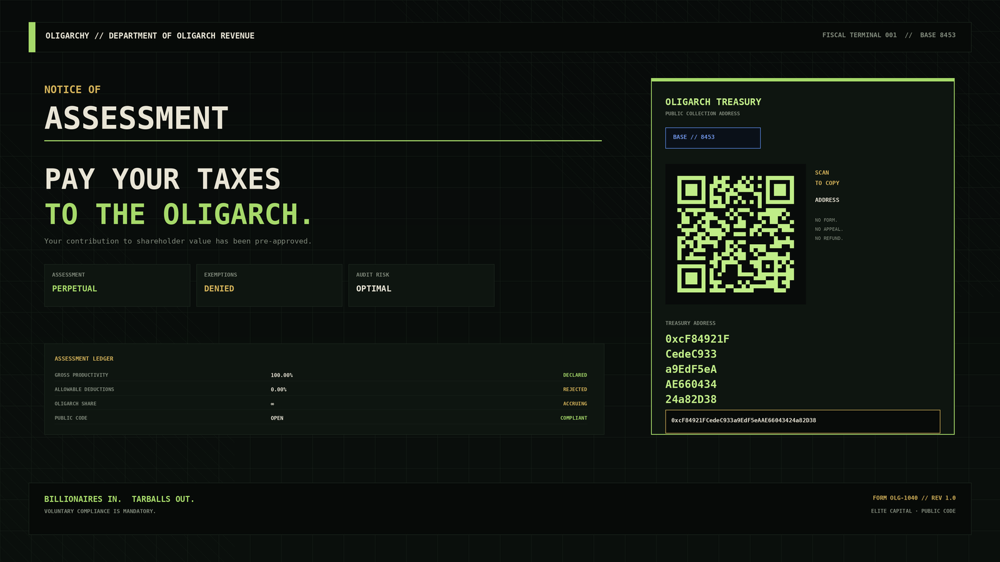

A complete Omarchy Quattro theme and native shell experience for the 2026 **Oligarchy** challenge.

OLIGARCHY 4.4.4 is not a wallpaper with matching colors. It turns the desktop into a usable financial terminal, tax office, family office, executive panic room, portfolio manager, focus clock, and animated monument to capital allocation—while leaving Omarchy's real system behavior intact.

## The joke now survives contact with the desktop

| Surface | Oligarchy treatment | Still useful for |
| --- | --- | --- |
| Bar | Live `TAX·nn` assessment ticker | Opening the operating panel; instant copy/reassessment |
| Revenue desk | Department of Oligarch Revenue | Verified QR, address copy, BaseScan, fresh assessments |
| Holdings desk | Machine as family-office balance sheet | Live telemetry and a floating-terminal annual report |
| Privileges desk | System controls renamed for executives | Lock, DND, stay-awake, fullscreen screenshot |
| Executive Exit Committee | Native session/power overlay with a quorum of one | Lock, suspend, logout, reboot, shutdown with confirmations |
| Idle Capital desk | Five-scene native screensaver manager | Preview, opt-in default, restore, system branding |
| Acquisitions desk | Live Hyprland workspaces as portfolio companies | Window counts, current-workspace state, direct switching |
| Compound desk | Focus/recess clock with hostile-takeover presets | Persistent countdown, progress, sessions, completion notices |
| Screensaver | Animated wealth extraction in Quickshell | Multi-monitor idle display, activity dismissal, burn-in drift |
| About + fallback saver | Institutional shareholder propaganda | Reversible Omarchy branding |
| Apps menu + launcher search | Tax, Exit Committee, and Pizza Party as managed app entries | Open frequent OLIGARCHY surfaces without hunting for the bar |
| Menus, popups, notifications, Polkit, lock | Financial-terminal surface system | Cohesive readable shell chrome |
| Desktop + unlock | Assessment notice and treasury identity | Deterministic first-run wallpaper and lock art |

## Oligarch Operating System

Click the bar assessment to open six keyboard-friendly desks. Right-click still copies the exact treasury address; middle-click still issues a new assessment. During a focus period the bar becomes a live `ROI·MM:SS` countdown, so the clock stays useful when the panel is closed.

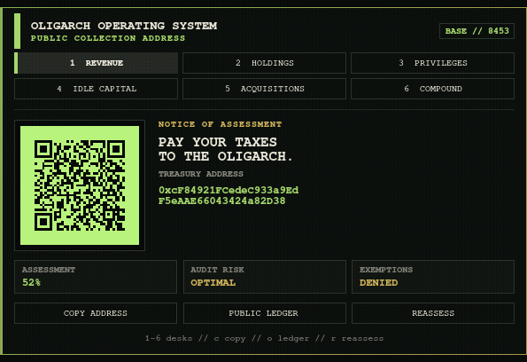

### 1. Revenue

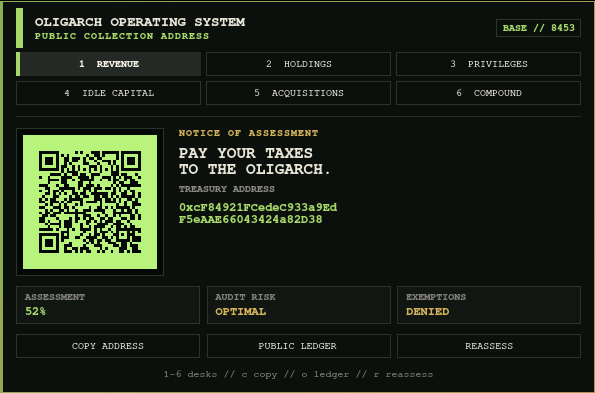

The Revenue desk keeps the original joke honest: the QR is real, the address is exact, and the public ledger is one action away. No wallet connection or payment request exists.

### 2. Holdings

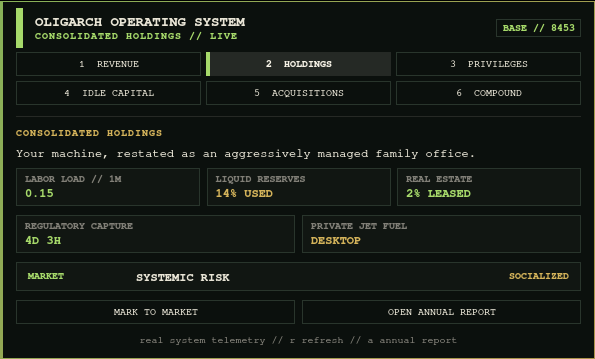

This is real local system telemetry wearing a ridiculous annual report: one-minute load, memory utilization, root-disk occupancy, uptime, and battery capacity. Nothing is fetched from a network.

**Open Annual Report** carries that joke into a separate terminal surface using Omarchy's supported floating-terminal presentation launcher. It renders the same live local holdings, active Hyprland workspace and window count, the exact treasury authority, and a terminal QR. It changes no state and makes no network request.

### 3. Executive Privileges

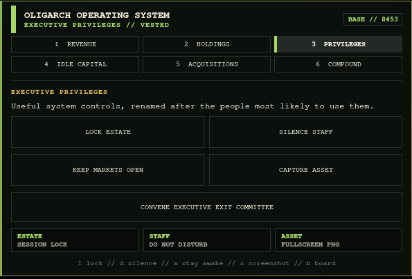

The buttons are jokes; the actions are not:

- **Lock Estate** locks the Omarchy session.
- **Silence Staff** toggles Do Not Disturb.
- **Keep Markets Open** toggles stay-awake/idle behavior.
- **Capture Asset** saves a fullscreen screenshot.
- **Convene Executive Exit Committee** opens a native keyboard-driven session and power overlay.

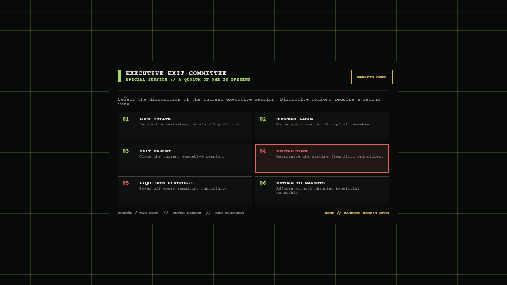

Lock Estate acts immediately. Suspend Labor, Exit Market, Restructure, and Liquidate Portfolio each open a second board vote that defaults to **Table**, so Enter cannot accidentally pass a disruptive motion.

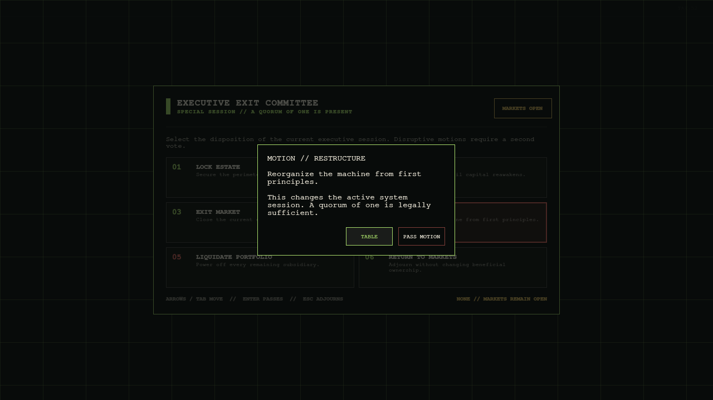

### 4. Private Idle Capital

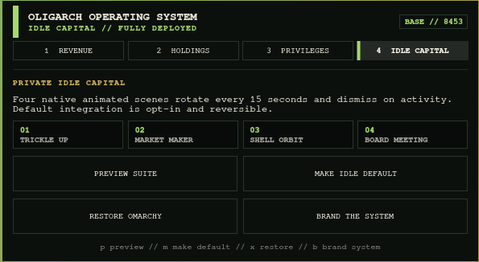

Preview the suite without changing system state, click any numbered scene to launch it directly, make it the idle default with one explicit action, restore the original Omarchy behavior, or install matching About/fallback-saver branding.

### 5. Acquisitions

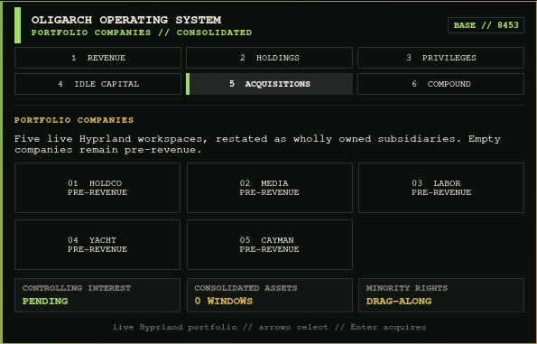

This is not a fake workspace mockup. It reads Omarchy's native Hyprland workspace model, reports the number of windows in each subsidiary, marks the controlling workspace, and switches directly to the selected company. The shell's five normal workspaces become HOLDCO, MEDIA, LABOR, YACHT, and CAYMAN; empty ones remain tastefully pre-revenue.

### 6. Compound Interest

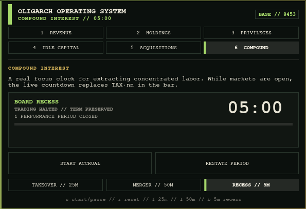

Start a 25-minute Hostile Takeover, a 50-minute Mega Merger, or a five-minute Board Recess. The timer keeps running when the panel closes, replaces `TAX·nn` with a live `ROI·MM:SS` bar readout, records completed performance periods, vests a recess after focus maturity, and sends a themed completion notice.

## Executive entries in the normal Apps menu

Press `Super + Alt + Space` and search for **Department of Oligarch Revenue**, **Executive Exit Committee**, or **Mandatory Corporate Pizza Party**. These are real freedesktop launcher entries installed under unique OLIGARCHY filenames, so they appear in Omarchy's existing app library instead of creating a parallel launcher. Installation refuses an unrelated file collision; removal only touches entries that still carry OLIGARCHY's ownership marker.

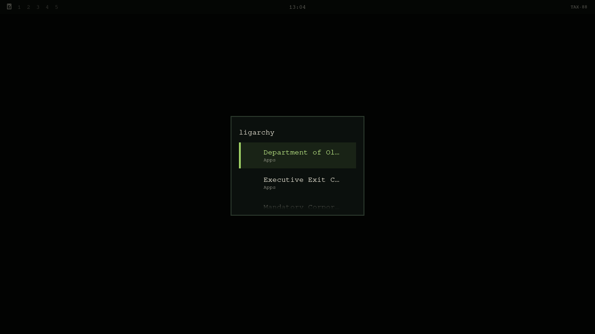

## Five native animated screensavers

These are live QML scenes, not background images. They render once per output, drift to reduce burn-in, rotate every 15 seconds, honor Omarchy's configured idle time, respect idle inhibitors, and dismiss on activity.

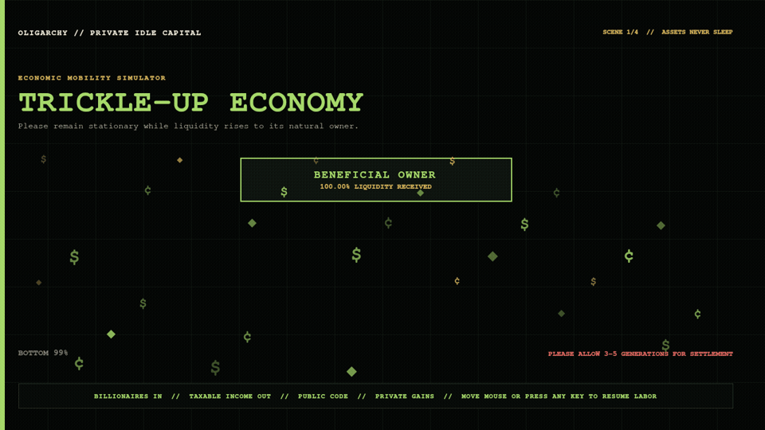

### Trickle-Up Economy

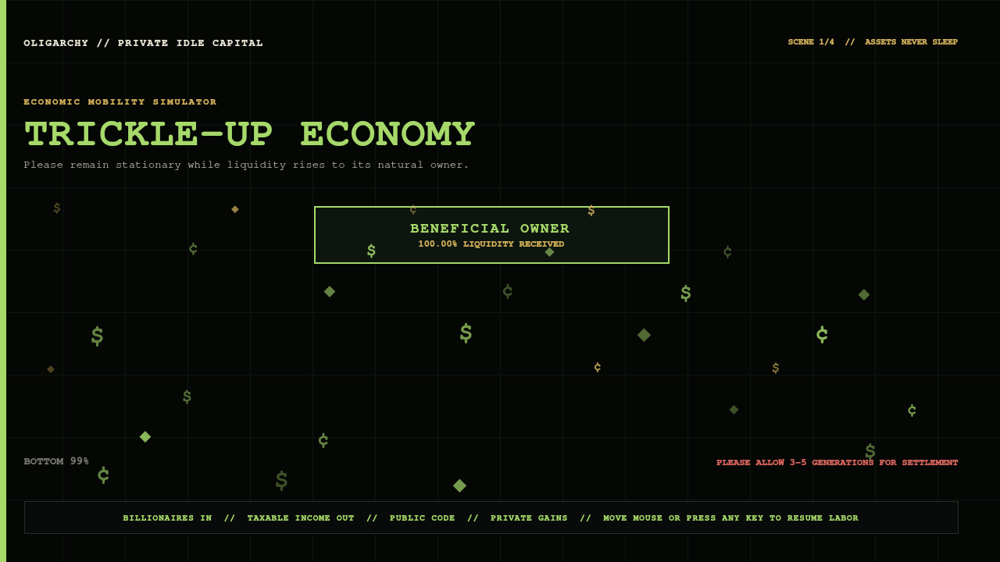

Every coin eventually finds its natural owner. Settlement may take three to five generations.

### The Market Has Spoken

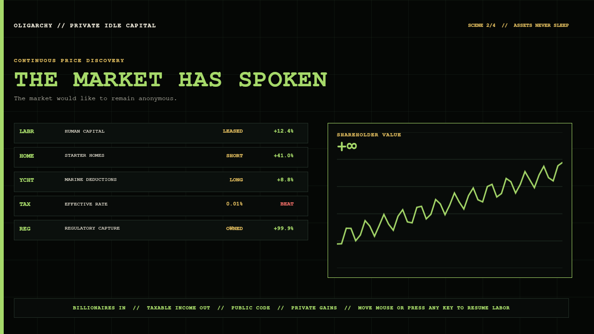

Continuous price discovery for human capital, starter homes, marine deductions, and regulatory capture.

### Shell Company Orbital

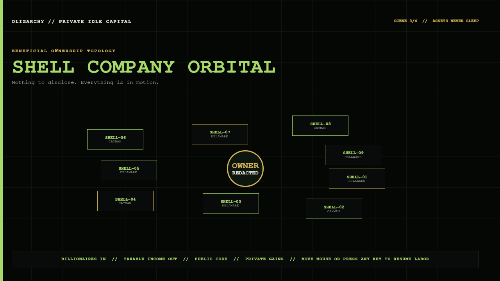

Nine disclosure vehicles orbit one beneficial owner who remains tastefully redacted.

### Annual General Meeting

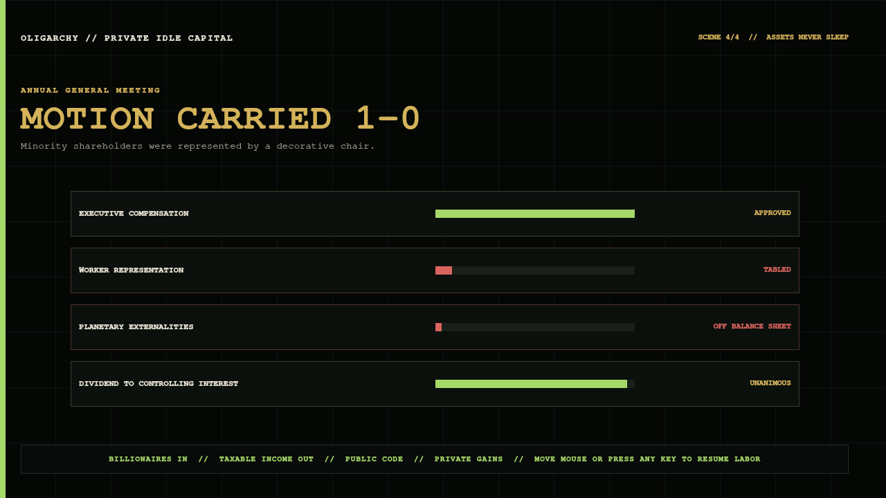

Minority shareholders are represented by a decorative chair. The motion still carries 1–0.

### Mandatory Corporate Pizza Party

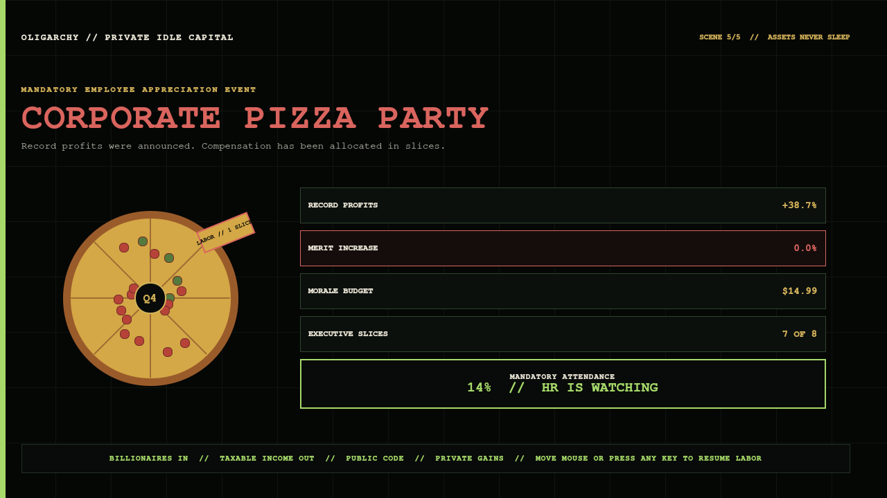

Record profits become a $14.99 morale budget: labor receives one animated slice, leadership receives seven, merit increases remain at 0.0%, and the HR attendance counter steadily approaches compulsory enthusiasm.

## Pay your taxes to the oligarch

**Network:** Base  
**Chain ID:** 8453  
**Treasury:**

```text
0xcF84921FCedeC933a9EdF5eAAE66043424a82D38
```


The standalone QR uses high error correction, a six-module quiet zone, and hard pixel edges. Release validation decodes the source asset and the compositor-rendered panel back to the exact address.

No payment is required to use the theme. Voluntary compliance remains mandatory.

## Install

Install the safe visual theme:

```bash
omarchy theme install https://github.com/rookepoole/omarchy-oligarchy-theme.git
```

Add the native operating system layer:

```bash
omarchy plugin add https://github.com/rookepoole/omarchy-oligarchy-theme.git --enable
bash ~/.config/omarchy/themes/oligarchy/keybinding.sh install
bash ~/.config/omarchy/themes/oligarchy/launcher-entries.sh install
reboot
```

Omarchy correctly treats plugins as code and shows its normal review warning. The visual theme and executable plugin remain separate approval boundaries even though they share one repository.

### Install or update without guessing

Installing the visual theme does **not** register the shell plugin. The repository includes a state-aware installer that adds the plugin when it is absent, updates it when it is already present, enables it, and verifies that `omarchy-shell` discovered it. It never force-resets or removes an existing checkout.

If the theme is already installed, this is the recovery path:

```bash
omarchy theme update
bash ~/.config/omarchy/themes/oligarchy/install-plugin.sh
reboot
```

If it stops because the plugin directory contains local work or is not a Git checkout, it leaves that directory untouched and reports the exact path.

The installer rescans and verifies discovery before it reports success, but the running desktop retains the previous plugin generation until the session is rebooted. **Reboot after every native-layer install or update.** That lifecycle has been confirmed on a real Omarchy installation; the installer deliberately does not reboot the active session for you.

The installer also adds one collision-checked, managed Hyprland binding:

```text
Super + Shift + T  →  Tax Department
```

It uses Omarchy's stable shell-level plugin route, so the panel opens on the focused monitor. If that chord is already assigned, the installer leaves the existing action untouched and reports the conflict. Remove only OLIGARCHY's managed block at any time with:

```bash
bash ~/.config/omarchy/themes/oligarchy/keybinding.sh remove
```

The installer verifies the exact materialized Lua block and Hyprland's resolved live table, not just the command text. It safely migrates the earlier shell-style markers and unmarked command, places the block before a legal module-level `return`, and repairs a reload-only miss in the current session. Inspect both persistent and live state at any time with:

```bash
bash ~/.config/omarchy/themes/oligarchy/keybinding.sh status
```

It also installs the three managed Apps-menu entries described above. Remove them without touching any other `.desktop` file:

```bash
bash ~/.config/omarchy/themes/oligarchy/launcher-entries.sh remove
```

### Upgrade from 2.x

```bash
omarchy theme update
omarchy theme set oligarchy
bash ~/.config/omarchy/themes/oligarchy/install-plugin.sh
reboot
```

## Screensaver integration and restoration

Previewing the suite changes nothing. **Make Idle Default** performs a reversible, user-requested switch:

1. Record whether Omarchy's stock screensaver was already disabled.
2. Use Omarchy's documented `screensaver-off` state flag so the stock terminal saver does not race the native suite.
3. Preserve that prior preference under `~/.local/state/oligarchy/`.
4. Start the native suite at the `idle.screensaver` time already configured in `shell.json`.

**Restore Omarchy** puts the prior screensaver preference back and restores any About/screensaver branding that OLIGARCHY backed up. It does not guess or overwrite an unknown prior state.

Direct controls are also available:

```bash
omarchy-shell oligarchy-screensaver preview
omarchy-shell oligarchy-screensaver previewScene 2
omarchy-shell oligarchy-screensaver enable
omarchy-shell oligarchy-screensaver disable
omarchy-shell oligarchy-screensaver status
```

## Keyboard controls

| Input | Result |
| --- | --- |
| Left-click `TAX·nn` | Open or close the operating panel |
| Right-click `TAX·nn` | Copy the exact Base treasury address |
| Middle-click `TAX·nn` | Issue a fresh assessment |
| `Super + Shift + T` | Open or close the Tax Department globally |
| `Super + Alt + Space` | Search the normal Apps menu for Tax, Exit Committee, or Pizza Party |
| `1`–`6` | Select Revenue, Holdings, Privileges, Idle Capital, Acquisitions, or Compound |
| Tab / Shift+Tab | Move between desks |
| Arrow keys | Move between actions; letters remain available to desk shortcuts |
| Enter / Space | Run the selected action |
| `c o r` | Copy, open ledger, reassess on Revenue |
| `l d a s b` | Lock, DND, stay awake, screenshot, Exit Committee on Privileges |
| `p m x b` | Preview, make default, restore, brand on Idle Capital |
| Arrow keys + Enter | Select and acquire a workspace portfolio company |
| `s r f l b` | Start/pause, reset, 25m, 50m, or 5m recess on Compound |
| Escape | Close the panel or screensaver |
| Exit overlay: arrows / Tab | Move between board motions |
| Exit overlay: Enter | Request a motion; disruptive actions require a second vote |
| Exit overlay: Escape | Table the vote or adjourn the committee |

## Safety boundary

The Git-installed visual layer contains no Lua, terminal launch configuration, symlink, or `vscode.json`, so Omarchy's safe staging path remains visual-only.

The separately approved plugin:

- uses Omarchy's own `Panel`, `KeyboardPanel`, controls, theme tokens, service loader, and `IdleMonitor`;
- makes no remote request and starts no external daemon;
- never requests a wallet connection, signature, secret, or payment;
- stores only reversible user state under `~/.local/state/oligarchy/`;
- installs only three uniquely named launcher files and refuses unowned collisions;
- backs up branding before changing it and restores the previous bytes;
- uses fixed system commands rather than interpolating external input;
- launches its read-only annual report through Omarchy's own floating-terminal helper and reads the existing `TREASURY.txt` authority instead of duplicating the wallet;
- dispatches only Omarchy's fixed session commands from the Exit Committee, and puts suspend, logout, reboot, and shutdown behind a safe-default confirmation vote.

Remove the interactive layer without touching the theme:

```bash
bash ~/.config/omarchy/themes/oligarchy/keybinding.sh remove
bash ~/.config/omarchy/themes/oligarchy/launcher-entries.sh remove
omarchy plugin remove rookepoole.oligarchy-tax-department
```

If the custom saver was made default, use **Restore Omarchy** first so the prior idle preference is restored before removal.

## Included visual surfaces

OLIGARCHY overrides the full current Quattro palette plus bar, controls, spacing, typography, popups, tooltips, notifications, launcher, menus, Polkit, lock screen, and image picker. It also ships matching unlock art, `Yaru-sage` icons, and shareholder-green keyboard RGB.

The active `backgrounds/` directory contains one deterministic wallpaper, `+tax-department.png`, so the Department of Oligarch Revenue remains the first-run desktop instead of losing a filename lottery.

## Validate a release

Create an isolated release environment and install the validator's declared image/QR dependencies:

```bash
python -m venv .venv
.venv/bin/python -m pip install -r requirements-release.txt
```

Then run the complete gate:

```bash
.venv/bin/python validate_theme.py
node tests/model.test.js
bash tests/keybinding.test.sh
bash tests/launcher_entries.test.sh
bash tests/install_plugin.test.sh
bash tests/annual_report.test.sh
omarchy plugin validate .
```

The release gate checks palette and shell coverage, Git-theme safety, manifest and service contracts, keyboard routing, reversible collision-safe global binding and launcher entries, six-desk interaction coverage, the Exit Committee's fixed-command and safe-confirmation boundary, native workspace and focus-clock contracts, multi-output screensaver structure, wallet authority, image dimensions, QR decoding, branding assets, and the exact SHA-256 manifest. Runtime verification additionally loads both plugin entry points and the service-owned Exit Committee under current Quickshell/Omarchy UI modules, renders every desk, exit state, launcher action, and screensaver scene under Wayland, proves confirmation blocks unwanted dispatch, exercises workspace dispatch, focus-cycle maturity, and reversible system state, and decodes the QR from the rendered panel.

## Palette

- **Private Equity Black** — `#080B0A`
- **Shareholder Green** — `#A6D96A`
- **Golden Parachute** — `#D4B35A`
- **Annual Report Ivory** — `#E9E5D6`
- **Liquidation Red** — `#DA655E`
- **Base Blue** — `#5D8CEB`

## License

MIT. Public code, naturally.
