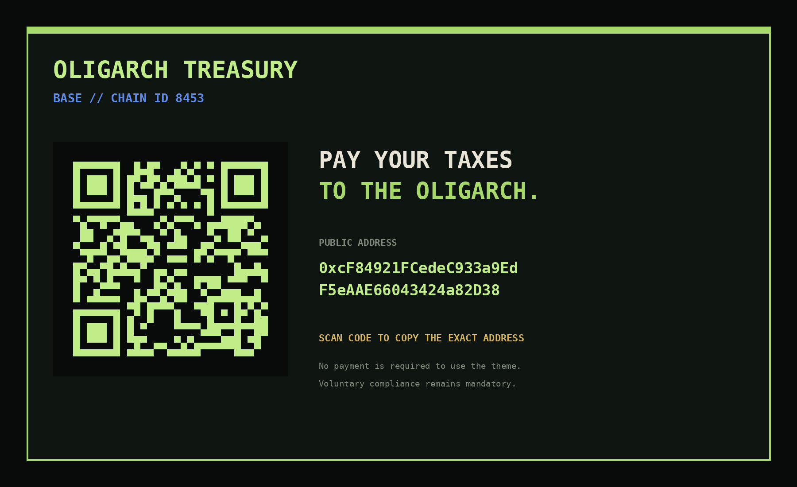

# OLIGARCHY

> **Elite capital. Public code. Pay your taxes.**


A complete Omarchy Quattro theme for the 2026 **Oligarchy** challenge.

The design language is equal parts financial terminal, government tax notice, 1980s annual report, private banking, and Unix workstation. The joke is loud enough to land and restrained enough to leave the desktop usable.

## The Department of Oligarch Revenue is the default

The active `backgrounds/` directory intentionally contains **one** wallpaper, prefixed with `+` so it sorts ahead of stale numeric backgrounds during manual upgrades:

`backgrounds/+tax-department.png`

That makes the Department of Oligarch Revenue the first-run OLIGARCHY desktop instead of relying on filename ordering among multiple wallpapers.

## Pay your taxes to the oligarch

**Network:** Base  
**Chain ID:** 8453  
**Treasury:**

```text
0xcF84921FCedeC933a9EdF5eAAE66043424a82D38
```



The main wallpaper contains both the full address and a QR code encoding the exact address.

After installation, copy the treasury address directly to the Wayland clipboard with:

```bash
wl-copy < ~/.config/omarchy/themes/oligarchy/TREASURY.txt
```

Or print it with:

```bash
cat ~/.config/omarchy/themes/oligarchy/TREASURY.txt
```

No payment is required to use the theme. Voluntary compliance remains mandatory.

## Install

```bash
omarchy theme install https://github.com/rookepoole/omarchy-oligarchy-theme.git
```

## Included theme surfaces

OLIGARCHY overrides the current Quattro palette plus the bar, controls, spacing, typography, popups, tooltips, notifications, launcher, menus, Polkit, lock screen, and image picker. It also ships matching unlock art, `Yaru-sage` icons, and shareholder-green keyboard RGB.

The repository deliberately includes no Lua, terminal launcher configs, or `vscode.json`, keeping the Git-installed theme color/art-only.

## Gallery

The gallery art is intentionally **not** inside `backgrounds/`, so it cannot replace the Tax Department as the automatic first-run wallpaper.

### Annual Report


### Hostile Takeover


## Palette

- **Private Equity Black** — `#080B0A`
- **Shareholder Green** — `#A6D96A`
- **Golden Parachute** — `#D4B35A`
- **Annual Report Ivory** — `#E9E5D6`
- **Liquidation Red** — `#DA655E`
- **Base Blue** — `#5D8CEB`

## License

MIT. Public code, naturally.
